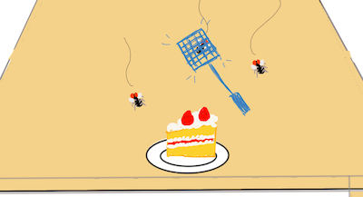

## 前書き

このページは、最近プログラミング学習としてゲーム作りを始めた知人に向けたものです。
筆者は日常的にプログラミングを行なっていますが、職業プログラマではありません。

この記事を通して伝えたいことは次の通りです。
* アイデアを、とりあえず動くように実装する方法
* とりあえず動くものをより洗練されたプログラムへ発展させていく考え方

この記事ではプログラミング言語としてPython3、ゲーム作りのライブラリとして[pyxel](https://github.com/kitao/pyxel)を用います。

基本的に不定期更新となりますが、進捗次第では連日更新します。

最後に僕から読者の方にメッセージです。

**Done is better than perfect.**

以上です。これから頑張りましょう。

(2021-07-25：公開)

## 開発に関して

あまり本筋ではない話ですが、ソフトウェア開発には多種多様な方法があります。有名なものにはアジャイル開発やウォーターフォール開発などがあり、書店などに行けば参考書なども多く出回っています。

ですが、趣味で行うプログラミングにあまり厳密なものを持ち込んでもしょうがないので、
この記事では最初にざっくりとした設計を行い、筋道を建てた後は拡張性を考えつつもプログラムが動くことを第一に実装していきます。

(2021-07-25：公開)

## どんなゲームを作りたいか考える

いきなりソースコードを編集し始める前に、どんなゲームを作るか考えてみることにします。

今回はゲームのジャンルとしてアクションゲームを作ることにして、
ざっと次のようなコンセプトを考えました。

- コンセプト
  - おやつに迫りよるハエをやっつけろ
- システム
  - マウスクリックでハエを退治
  - 退治したハエが落とすアイテムでパワーアップ
  - 制限時間内にどれだけスコアを稼げるか
  - ある一定スコアを超えるとボスが出現

といった感じで作ってみようと思います。時間に余裕があれば、発展として

* 異なる効果を持つアイテムの追加
* ステージの導入
* コンボシステムの導入
* スコアランキングの導入

などが出来ると思います。

ゲーム画面の模式図をお絵かきしてみると次のような感じです。ここにスコア表示などを追加していくことになります。



上記のようなゲームを実現するまでの過程を、その試行錯誤も含めて紹介していく予定です。

(2021-07-25：公開)

## 必要な機能を考える

前回はゲームのざっくりとしたシステムを考えました。

今回はこのシステムに沿って、ゲームに必要な機能を考えて行きます。
おさらいすると、

> - システム
>   - マウスクリックでハエを退治
>   - 退治したハエが落とすアイテムでパワーアップ
>   - 制限時間内にどれだけスコアを稼げるか
>   - ある一定スコアを超えるとボスが出現

といった感じです。ここから必要な機能とモノを考えて見ます。

* マウスクリックでハエを退治 -> クリックによる攻撃判定、ハエの当たり判定の定義
* 退治したハエが落とすアイテムでパワーアップ -> アイテムによる強化（攻撃範囲の拡大？）、アイテムの取得判定、アイテムドロップ率
* 制限時間内にどれだけスコアを稼げるか -> スコアの導入、表示
* ある一定スコアを超えるとボスが出現 -> ボスそのもの、ボス用の体力判定

このうち、主役となるのは主人公とハエです。これらの動作について考えてみましょう。

クリックされた際の内部処理はブロック図で表すと次のようになると思います。


特に、赤枠で囲まれた部分はアイテムやハエ、後で追加するボスハエなどに応じて追加していきます。
上から番号をつけて
1. マウスがクリックされたかどうかの判定
2. マウスカーソルの位置を取得
3. 
    * 攻撃範囲内部にハエがいるか判定
    * ハエの表示を消す。スコアの加算
4. 
    * 攻撃範囲内部にアイテムがあるか判定
    * アイテムを消す。アイテム取得状態の有効化

としておきます。

ハエに関しては


5. 画面上部ランダムな位置に出現
6. おやつに向かって移動
7. 攻撃を受けたかを判定
8. 攻撃を受けた場合、表示を消してスコアを加算

といったところでしょうか。

上の二つの図を比べるとクリックされた時のハエに関する処理が重複していますが、
今は実際にどのようにプログラミングするかを考えていないのでこれで良いでしょう。

次回からはこれらを少しづつpyxelに実装していきます。

(2021-07-25：公開)

## 主人公の核を作る

前回までにゲームのメイン要素となるハエタタキ（主人公）とハエのざっくりとした挙動を考えました。この記事ではこれを一つ一つ実装していきます。

以下ではgithubの機能であるブランチを使わずに、
`develop_component.py`と
`friedfly_game.py`
の二つのファイルを使って開発していきます。
`develop_component.py`では実装したい機能の試験を行い、`friedfly_game.py`では実装が終わったものを随時追加していきます。

以下、`update`,`draw`と言った場合には、`develop_component.py`内の`class App()`の`self update(self)`と`self draw(self)`を指します。
なるべく変更点は記事に載せていきますが、`...`と書いてある場合は直前に出てきたものが省略されていると思ってください。

さて、主人公の挙動をおさらいすると、

> 1. マウスがクリックされたかどうかの判定
> 2. マウスカーソルの位置を取得

が必要でした。今回はこの二つに絞って実装を試みます。

### クリックの判定

まず、1.を実装するために[pyxel](https://github.com/kitao/pyxel)のreferenceを読んでみます。

すると、マウスカーソルを表示する関数`mouse(visible)`があったので`update`に追加してみます。

```python
def update(self):
        # quit a game when Q is pressed
        if pyxel.btnp(pyxel.KEY_Q):
            pyxel.quit()
        # display the cursor
        pyxel.mouse(True) ##### ここです #####
```

実行してみると、ゲーム画面上にマウスカーソルが表示されるようになりました。確認してみてください。
動作が期待通り行われているかを確認するためにも、しばらくはカーソルを表示してままにしておきます。

さて、次にクリックされたかの判定をしてみます。

[ここ](https://github.com/kitao/pyxel/blob/master/pyxel/__init__.py)を見ると、pyxelで使えるkeyの一覧が見られます。
193行目の`MOUSE_LEFT_BUTTON`が怪しいですね。試しに使ってみましょう。

``` python
    def __init__(self):
        self.mouse_pressed = False
        ...

    def update(self):
        ...
        pyxel.mouse(True)
        # check if a mouse is pressed
        if pyxel.btn(pyxel.MOUSE_LEFT_BUTTON): ##### ここです #####
            self.mouse_pressed = True

    def draw(self):
        # fill the screen with a black
        pyxel.cls(pyxel.COLOR_BLACK)
        # draw circle when mouse left button is pressed
        if self.mouse_pressed: ##### ここです #####
            pyxel.circ(80, 80, 30, pyxel.COLOR_RED)
```

ここではクリックされたかどうかの情報をdrawに引き継ぐために、`self.mouse_pressed`を導入し、`circ`も使用しました。

プログラムを実行してみると、クリックによって赤い円が表示されました。成功です！！！

しかし、一度クリックすると円が表示されたままになってしまいます。
これだとハエを叩くという動作が一度しかできないですね。

これはif文によってボタンが押されている時だけ、`mouse_pressed`を`True`に
するという書き方になっているためです。

ボタンを押すたび、もしくは押している間だけ円を書くためには、`mouse_pressed`を`False`に戻してやる必要があります。

なので、次の様に変更してみましょう。

``` python
    def update(self):
        ...
        pyxel.mouse(True)
        # check if a mouse is pressed
        self.mouse_pressed =  pyxel.btn(pyxel.MOUSE_LEFT_BUTTON): ##### ここです #####
```
`btn`はこの関数が呼ばれた時に、指定したボタンが押されていれば`True`、そうでなければ`False`を返してくれます
。これでフレーム毎にマウスが押されているかを判定できるようになりました。

### マウス位置の取得

最後に、2.を実装します。
今回はのマウスをクリックした位置に応じて円の場所を変えてみましょう。

変更点は次の通りで
```python
    def update(self):
        ...
        self.mouse_pressed =  pyxel.btn(pyxel.MOUSE_LEFT_BUTTON)
        if self.mouse_pressed: ##### ここです #####
            self.circ_x = pyxel.mouse_x
            self.circ_y = pyxel.mouse_y

    def draw(self):
        ...
        if self.mouse_pressed:
            pyxel.circ(self.circ_x, self.circ_y, 30, pyxel.COLOR_RED) ##### ここです #####
```

実行した結果がこちら。マウス左ボタンは押したまま動かしています。


良さそうですね。

### まとめ

それではこの記事のまとめです。

今回は
* `mouse()`でカーソルを表示する
* マウスがクリックされたかを`btn()`で判断する
* マウスの位置を`mouse_x`、`mouse_y`で取得する
* `circ()`を使って円を書く

ことに挑戦しました。

特に`btn()`の返り値を`draw()`に引き継ぐことで、ボタンが押されている間だけ円を表示しました。

今後`mouse_x`と`mouse_y`を取得した部分に、クリックされた時にだけ必要な処理を追加していきます。

最新版のソースコードのcommit IDは`a3a4e3d`です。

(2021-07-25：公開)

## ハエを叩くモーションを作る

さて、前回はマウスのクリックを認識させ、カーソルの位置に円を描画してみました。

今回はこれを応用して、マウスをクリックした時にだけハエを叩くアニメーションが表示されるようにしてみましょう。

今回は、処理がフレームをまたぐことになるのでなるべく丁寧に解説します。

さて、`pyxeledior`を使って次の様な画像を用意しました。


今回の目標はこの三つの画像のうち、マウスをクリックしない間は一番左を表示しておき、クリックされた際に右に移り変わっていくようなプログラムを実現します。

まずは、前回の円の表示と何が違うか考えてみましょう。

### フレームについて

ゲームにはフレームという概念があり、一秒あたりのフレーム更新回数をFrame per second (FPS)と呼びます。
FPSが大きくなるほどゲーム画面の更新が頻繁に行われ、見た目には滑らかなゲームになるわけですね。

前回に円を表示した際には、全ての処理を同一フレーム内で完結させていました。
言い換えると一組の`update()`と`draw()`で済んでいたわけです。

単純に考えれば、マウスがクリックされた時に画像を三枚順に表示すれば良いですが、
それだと人間にはあまりに一瞬すぎて良いアニメーションには見えません。

各画像を表示する間にゲームを一時停止するという方法もありますが、その他の処理は継続したいです。
そこで、処理を複数フレームに跨がるようにすることで、ゲームを止めずにアニメーションを表示します。

具体的に実装してみましょう。

まず`__init__()`と`update()`を次のように書き換えます。

```python
    def __init__(self):
        self.mouse_pressed = False
        self.drawing_anime = False ##### ここです #####
        self.frame_anime_init = 0 ##### ここです #####
        self.circ_x = 80
        self.circ_y = 80
        pyxel.init(160, 160, caption="Fried fly", fps=30)
        pyxel.load('friedfly.pyxres') ##### ここです #####
        pyxel.run(self.update, self.draw)

    def update(self):
        ...
        pyxel.mouse(True)
        # check if a mouse is pressed
        self.mouse_pressed = pyxel.btnp(pyxel.MOUSE_LEFT_BUTTON)
        ##### ここから #####
        self.circ_x = pyxel.mouse_x
        self.circ_y = pyxel.mouse_y
        if self.mouse_pressed and not self.drawing_anime:
            self.drawing_anime = True
            self.frame_anime_init = pyxel.frame_count
```
`__init__()` には今回の処理で必要な値の初期宣言をいています。

重要な役割を果たすのは`if self.mouse_pressed and not self.drawing_anime:`から始まるif文です。

このif文により、ハエ叩きアニメーション（以下、叩きアニメ）の表示が進行中でない場合かつマウスがクリックされた時にだけ、
叩きアニメを開始するようにしています。
if文の条件に`not self.drawing_anime`があるのは、叩きアニメ表示中に再度`not self.drawing_anime`を書き換えられないようにするためです。

さらに、クリックしていない時でもハエ叩きをカーソルの位置に表示し続けたいので、`circ_x`と`circ_y`はif文の外に出ていることに注意してください。
`self.frame_anime_init`はアニメーション終了のタイミングを決めるため、叩きアニメ開始のタイミングを保存しています。

以上で追加した`self.drawing_anime`と`self.frame_anime_init`を用いて、叩きアニメを描画する処理を実現しましょう。

具体的には

`self.drawing_anime = True`になる -> アニメーションを一定時間表示する -> `self.drawing_anime = False`に戻す

ということができれば良いわけです。加えて、`self.drawing_anime = False`の時には動いていないハエ叩きが表示されるようにしましょう。

これを`draw()`に追加してみると次のようになります。

```python
    def draw(self):
        pyxel.cls(pyxel.COLOR_BLACK)
        if self.drawing_anime:
            # Count how many frames were passed from the begining
            current_frame = pyxel.frame_count - self.frame_anime_init
            # First four frames
            if current_frame//4 == 0: pyxel.blt(self.circ_x, self.circ_y, 0, 16, 0, 16, 32, pyxel.COLOR_BROWN)
            # Next four frames
            if current_frame//4 == 1: pyxel.blt(self.circ_x, self.circ_y, 0, 32, 0, 16, 32, pyxel.COLOR_BROWN)
            # if the animation lasts more than eight frames, kill it.
            if current_frame >= 8:
                self.drawing_anime = False
        else:
            # nominal state (without a click)
            pyxel.blt(self.circ_x, self.circ_y, 0, 0, 0, 16, 32, pyxel.COLOR_BROWN)

```

ここで重要なのは最初のif文です。
ここでハエ叩きアニメを表示するべき状態なのかを判別し、通常時（`else`）は左端の画像を表示しています。
`else`の中身は通常の状態なんだからif分の前に書いてはいけないの？と思うかもしれませんが、
現在のコードでは毎フレームで画面を黒塗りし（`pyxel.cls(pyxel.COLOR_BLACK)`）、その後に画像を表示しているので画像が重なってしまいます。

そういうわけで叩きアニメを表示する状態とそうでない状態に分ける必要があります。

if文の中身を解説していきましょう。

はじめに`current_frame`を定義しています。ゲームの正解ではフレーム数が時間に相当するので、フレームの数を数えることで時間の経過を取り扱えます。

叩きアニメが始まってからのフレーム数をカウントしたいので、現在のフレーム`pyxel.frame_count`から`self.frame_anime_init`を引くことで
経過時間をカウントしています。

その後二行がアニメーションの核となる部分です。

`//`は代数演算子のひとつで、割り算をしてその小数点以下を切り捨てた値を返します。

ここでは各画像を4フレームづつ表示するとした決めました。すると最初の4フレームは真ん中の画像、後の4フレームは右の画像を表示したいわけです。

そのため0から7フレームまでのうち、0,1,2,3と4,5,6,7で処理を分けたくなります。こんな時に使えるのが`//`なわけです。

4未満の数字は4で割ると1未満になるので、0になり、4から7は1になるので、この条件を使って場合わけができます。

それが`if current_frame//4 == 0:`と`if current_frame//4 == 1:`の部分に相当する訳ですね。

最後に8フレーム以上の時間が経過した際には、`self.drawing_anime`を`False`に戻すことで、通常時の描写に戻します。

これでクリックするたびにハエを叩くアニメーションが表示されるはずです。さて、動かしてみましょう。


いい感じですね。だんだんゲームらしくなってきました。

次回はスコアを導入して、敵をクリックするとスコアが増える仕組みを考えてみたいと思います。

(2021-07-28：公開)
